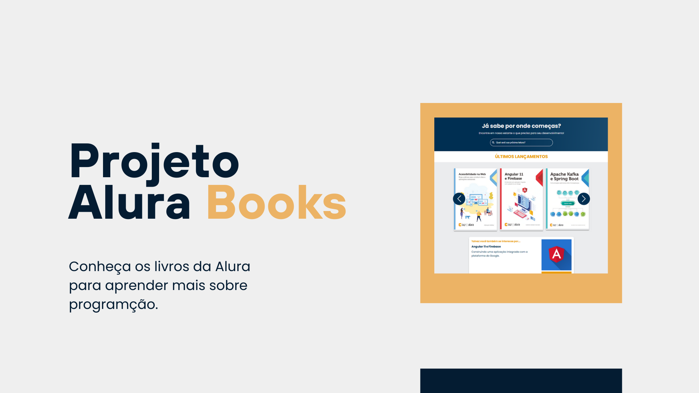

# Imagem

<h1 style="text-align: center">Alura Books</h1>

Conheça os livros da Alura para aprender mais sobre programção.

## <a href="#status">🚧 Status: Finalizado</a>

### Navegação

- <a href="#functionalities">⚙️ Funcionalidades</a>
- <a href="#tech">💻 Técnicas e tecnologias utilizadas</a>
- <a href="#acess">📁 Acesso ao projeto</a>
- <a href="#run">👨‍💻 Abrir e rodar o projeto</a>
- <a href="#more">📚 Mais informações do curso</a>
- <a href="#licence">✅ Licença</a>

## <a id="functionalities">⚙️ Funcionalidades</a>

O app Alura Books é criando pensado em oferecer aos usuários acesso a leituras de livros escritos pela Alura que insentivam e ensinam a programar.

O projeto criado em HTML e CSS tem inteirações apenas com displasy e hovers, coisas básicas das tecnologias.

## <a id="tech">💻 Técnicas e tecnologias utilizadas</a>

HTML: O HTML foi usado para arquitetar o projeto com uma estrutura bem pensada e semântica para a boa leitura da máquina e um bom desenvolvimento do design do projeto com CSS também aplicando algumas classes de ID's para uma aplicação mais rápida nos CSS.

CSS: O CSS tem papel fundamental para indicar a interação do usuário com a interface gráfica: o que são links, tamanhos, acessibilidade, responsividade para que o projeto seja acessado por todos com uma boa experiêcia. Para isso usamos algumas técnicas como:

- Flex e Grid
- Responsividade
- Media Query
- Display

SwiperJS: usamos um plugin para termos uma agilidade na parte de criar um swiper para apresentação dos livros assim evitando um código CSS maior e mais demorado.

## <a id="acess">📁 Acesso ao projeto</a>

Você pode acessar o app clicando [aqui](https://vagnernatvidade.github.io/alura-books/ "Alura Books link").

## <a id="run">👨‍💻 Abrir e rodar o projeto</a>

Para abrir e rodar o projeto, basta clona-lo em sua máquina e abrir o aquivo index.html no navegador.

## <a id="more">📚 Mais informações do curso</a>

Busque na plataforma da Alura o curso HTML e CSS para web e responsividade: crie páginas dinâmicas publicado na Escola Frontend.

## <a id="licence">✅ Licença</a>

MIT License  
Copyright (c) 2025 Vagner Junior Nativ  
Permissão é concedida, gratuitamente, a qualquer pessoa que obtenha uma cópia deste software...
